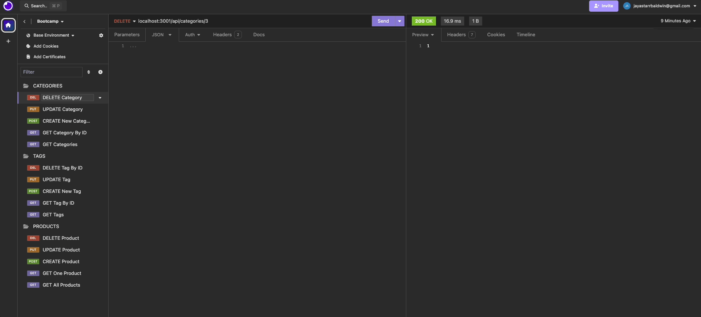

<br>
  <h1 align="center">E-Commerce Back End using Object-Relational Mapping (ORM)</h1>

      

## Description
In the realm of modern business, e-commerce has become a cornerstone, facilitating seamless transactions between businesses and consumers, especially in the electronics industry. With the burgeoning growth of e-commerce platforms like Shopify and WooCommerce, it's imperative for developers to grasp the foundational architecture of such platforms.

This repository encompasses the task of constructing the back end for an e-commerce website by leveraging the power of Object-Relational Mapping (ORM). The primary objective is to configure a functional Express.js API integrated with Sequelize, a powerful ORM tool, to interact with a MySQL database.

#### This application, upon setup and execution, facilitates the following functionalities:

1. <strong>Connection to Database:</strong> Upon adding database credentials to an environment variable file, the application connects to a MySQL database using Sequelize.

2. <strong>Database Initialization:</strong> When schema and seed commands are executed, a development database is created and populated with test data.

3. <strong>Server Invocation:</strong> After invoking the application, the server starts, and Sequelize models are synchronized with the MySQL database.

4. <strong>API Endpoint Access:</strong> Upon opening API GET routes in tools like Insomnia for categories, products, or tags, the application fetches data from the database and presents it in a formatted JSON format.

5. <strong>CRUD Operations:</strong> Testing API POST, PUT, and DELETE routes in Insomnia enables the successful creation, update, and deletion of data within the database.

In essence, this application provides a robust back end infrastructure for an e-commerce site, allowing seamless interaction with a MySQL database through a well-configured Express.js API.

<br>


### Brief functionality walk through:




## Table of Contents

- [Technologies Used](#technologies-used)
- [Installation](#installation)
- [User Story](#user-story)
- [Acceptance Criteria](#acceptance-criteria)
- [Usage](#usage)
- [Testing](#testing)
- [License](#license)
- [Contributing](#contributing)
- [Questions](#questions)

## Technologies Used
- JavaScript
- Node.js
- Express.js (version 4.18.2)
- MySQL2 (version 3.9.1)
- Sequelize (version 6.37.1)
- Dotenv (version 16.4.4)

## Installation

  `npm init -y`: create a package.json file
  <br>
  `npm install`: install dependencies

### Dependencies

  `npm i mysql2`: database management system
  <br>
  `npm i sequelize`: node.js-based Object Relational Mapper, that simplifies interacting with SQL
  <br>
  `npm i express`: back end web application framework to build the RESTful APIs
  <br>
  `npm i dotenv`: protection of sensitive information

## User Story

```md
AS A manager at an internet retail company
I WANT a back end for my e-commerce website that uses the latest technologies
SO THAT my company can compete with other e-commerce companies
```

## Acceptance Criteria

```md
GIVEN a functional Express.js API
WHEN I add my database name, MySQL username, and MySQL password to an environment variable file
THEN I am able to connect to a database using Sequelize
WHEN I enter schema and seed commands
THEN a development database is created and is seeded with test data
WHEN I enter the command to invoke the application
THEN my server is started and the Sequelize models are synced to the MySQL database
WHEN I open API GET routes in Insomnia for categories, products, or tags
THEN the data for each of these routes is displayed in a formatted JSON
WHEN I test API POST, PUT, and DELETE routes in Insomnia
THEN I am able to successfully create, update, and delete data in my database
```

## Usage
Run this application with the command:

## Testing

## License

The application is covered under the following license: [MIT](https://opensource.org/licenses/MIT)

## Contributing

I will not be accepting contributions to this repository at this time.
<br>

## Questions

Questions about this repository? My best point of contact is via [Email](mailto:jayastarrbaldwin@gmail.com)
<br>
If you'd like to view more of my work in GitHub, my profile is: [jayabaldwin](https://github.com/jayabaldwin)